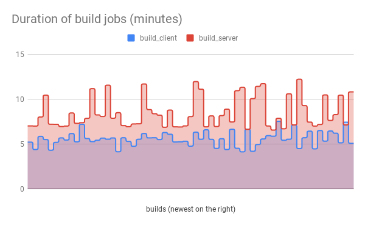

Show a summary of GitLab job durations
======================================

GitLab CI is nice, but I miss build time trends graphs from Jenkins.
So here's a script that can at least compute some summary information::

  $ ./gitlab_jobs.py --project 30 --csv jobs.csv
  Last 20 successful pipelines of myproject master:
    ...

  Summary:
    build_client      min  4.2m, max  7.6m, avg  5.8m, median  5.7m, stdev  1.0m
    build_docker      min  2.7m, max 11.6m, avg  3.5m, median  3.0m, stdev  1.9m
    build_server      min  6.6m, max 12.2m, avg  8.9m, median  8.1m, stdev  1.9m
    test_robot        min 25.4m, max 38.3m, avg 30.0m, median 29.1m, stdev  3.6m
    unittests_client  min  1.1m, max  7.9m, avg  4.1m, median  4.6m, stdev  2.5m
    unittests_server  min  3.5m, max  6.3m, avg  4.9m, median  5.1m, stdev  0.9m
    overall           min 37.4m, max 55.8m, avg 45.6m, median 45.6m, stdev  3.8m

  Writing jobs.csv...

You can then import the CSV file into a spreadsheet and produce nice charts
like

(NB: this chart has the X axis flipped and the Y axis scaled, because that
makes more sense to me.  The CSV data contains durations in seconds,
newest first.)

Requirements
------------

You need Python 3 and python-gitlab_ (``pip3 install --user python-gitlab``).

Configuration
-------------

Create a ``~/.python-gitlab.cfg`` like this::

   [global]
   default = mygitlab

   [mygitlab]
   url = https://gitlab.example.com/
   private_token = ...

You can create a private access token in your GitLab profile settings.  It'll
need the "api" access scope.

Usage
-----

You'll need a GitLab project ID.  You can find it by using the command-line
client from python-gitlab_::

    gitlab project list --all

Now you can do ::

    ./gitlab_jobs.py --project ID ...

Help is available via ::

    $ ./gitlab_jobs.py --help
    usage: gitlab_jobs.py [-h] [--version] [-v] [-g GITLAB] -p ID [-b REF]
                          [--all-branches] [-l N] [--csv FILENAME]

    Show GitLab pipeline job durations.

    optional arguments:
      -h, --help            show this help message and exit
      --version             show program's version number and exit
      -v, --verbose         print more information
      -g GITLAB, --gitlab GITLAB
                            select configuration section in ~/.python-gitlab.cfg
      -p ID, --project ID   select GitLab project (you can discover project IDs by
                            running gitlab project list --all)
      -b REF, --branch REF, --ref REF
                            select git branch
      --all-branches        do not filter by git branch
      -l N, --limit N       limit analysis to last N pipelines
      --csv FILENAME        export raw data to CSV file

.. _python-gitlab: https://pypi.org/p/python-gitlab
